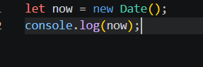
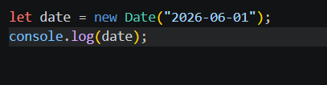
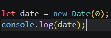
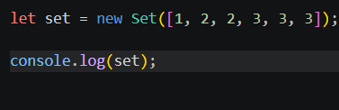
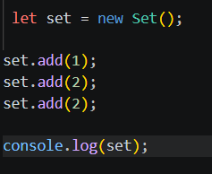

# new Date()
 работа с датой и временем в JavaScript

Date — это встроенный объект в JavaScript, который используется для работы с датой и временем. Когда мы пишем new Date(), мы создаём объект, который содержит информацию о текущем времени или о конкретной дате, которую мы передали.

📌 Что делает new Date()

new Date() может создавать дату в нескольких вариантах: 
 * 1 Текущая дата и время
 
 

 Возвращает текущую дату, время, секунды и часовой пояс компьютера

* 2 Дата из строки

Создаёт дату из текстового формата.

* 3 Создаёт дату из текстового формата.

Это количество миллисекунд с 1 января 1970 года (начало времени в JavaScript)

* Полезные методы Date

После создания даты можно получать отдельные части:

let now = new Date();

now.getFullYear();   // год
now.getMonth();      // месяц (0–11)
now.getDate();       // день
now.getHours();      // часы
now.getMinutes();    // минуты
now.getSeconds();    // секунды

⚠️ Важно: getMonth() начинается с 0
(0 = январь, 11 = декабрь)

# new Set() 
 коллекция уникальных значений в JavaScript

Set — это встроенная структура данных в JavaScript, которая хранит только уникальные значения. Если ты добавишь одинаковые элементы, дубликаты автоматически удаляются

* Что делает new Set()

Set используется, когда нужно хранить список значений без повторов

* Основные методы Set

# new Map()
  коллекция пар «ключ → значение» в JavaScript

Map — это встроенная структура данных в JavaScript, которая хранит данные в виде ключ → значение. Каждому ключу соответствует своё значение.

Map похож на объект (Object), но более гибкий и удобный для хранения больших объёмов данных.

* 
